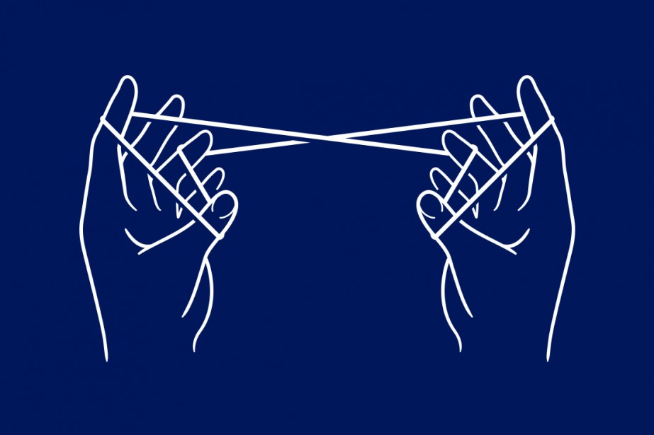
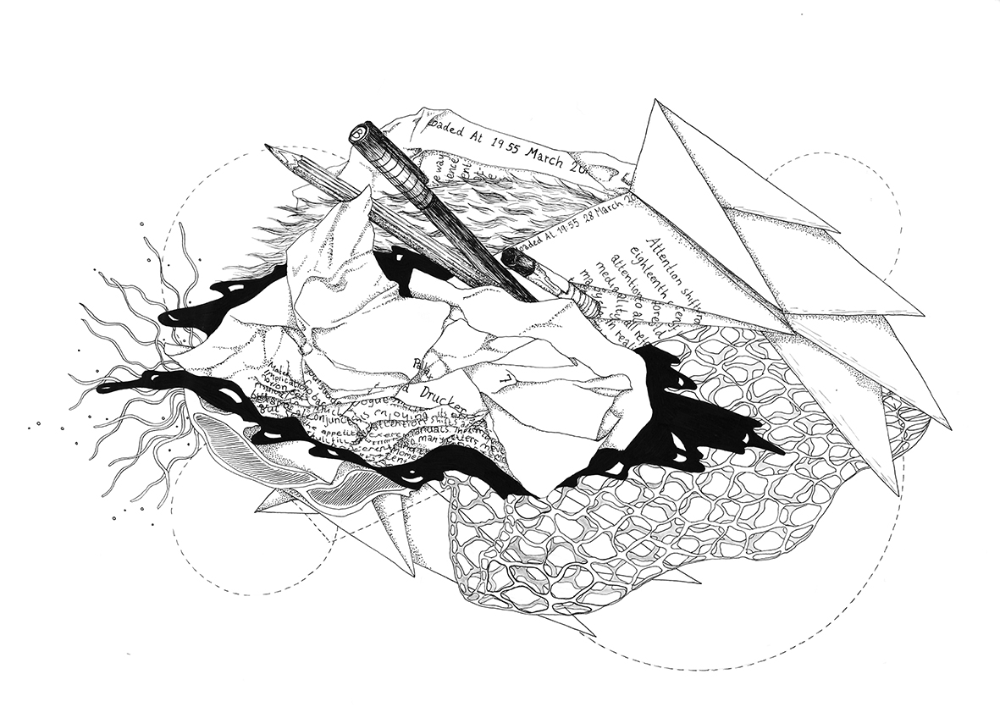
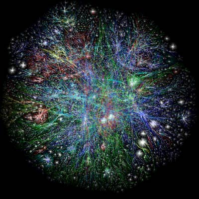
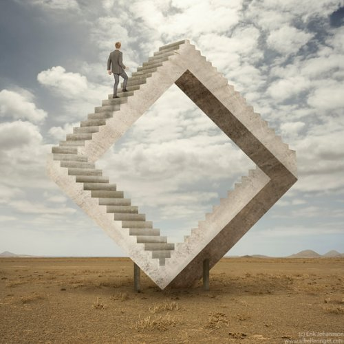
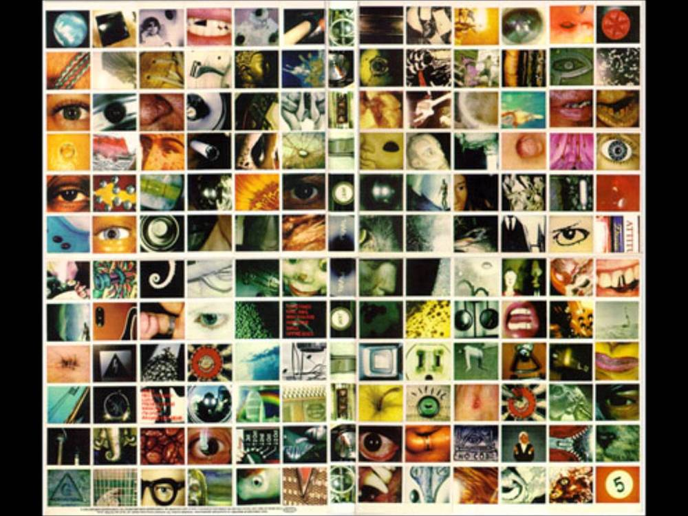
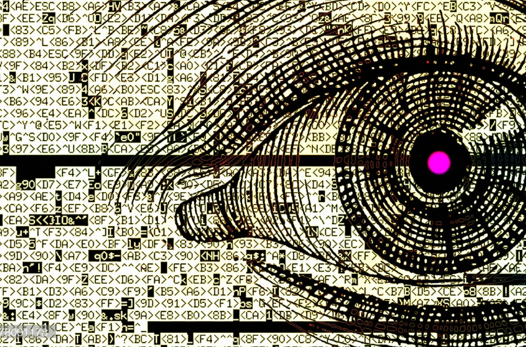
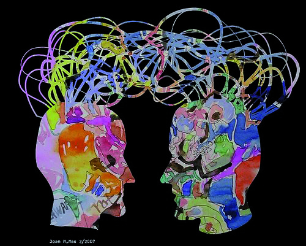
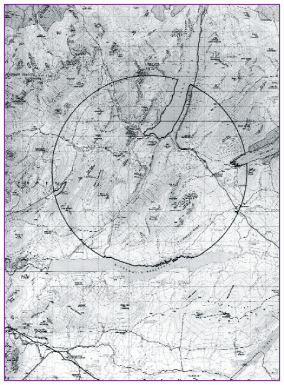
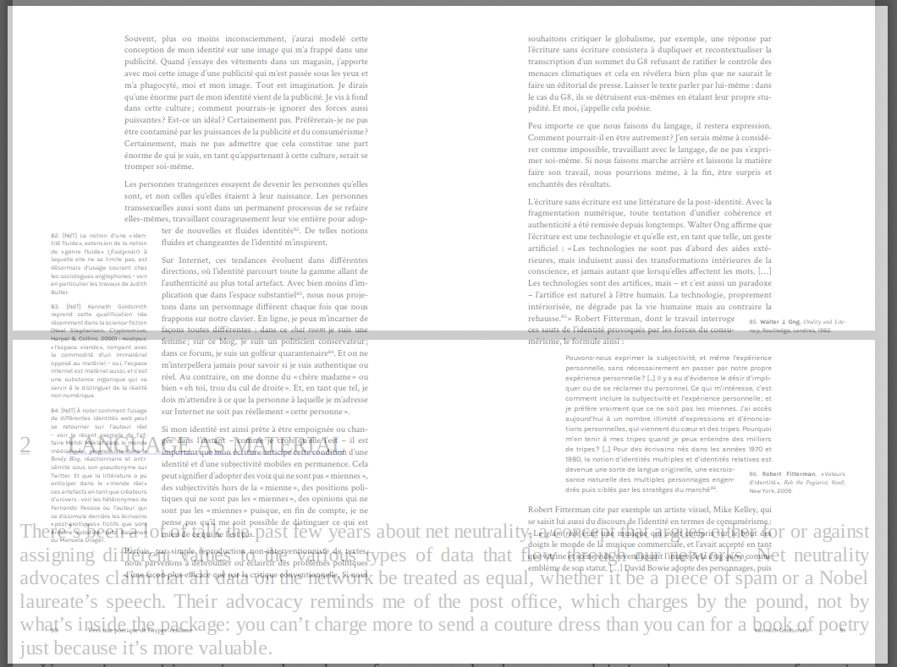
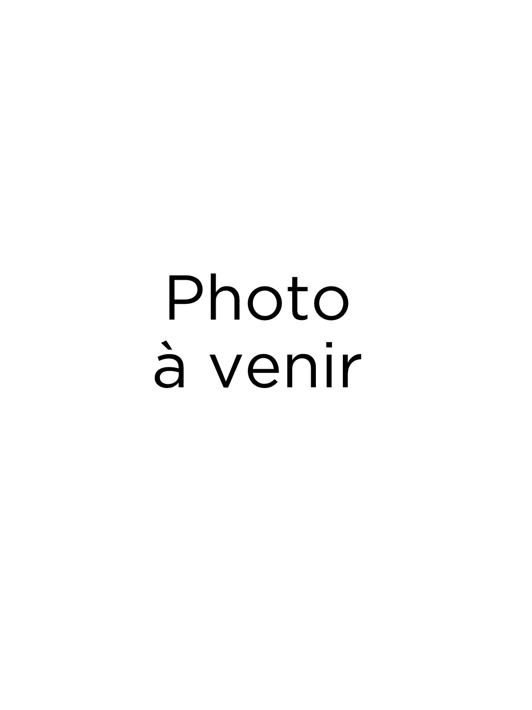

# FRA3715_H2020 : *Écriture et nouveaux médias*

## Séance 1 - *Introduction* : 15 Janvier

### Matériel asynchrone : 

[1.] Présentation des enjeux du cours

<ul>
  <li><a href="https://mmellet.github.io/fra3715_h2020/podcast/Seance-1/Seance-1-1.mp4" onclick = "window.open(this.href); return false;">podcast</a></li>
  <li><a href="https://mmellet.github.io/fra3715_h2020/slides/Seance-1-1.html#/" onclick = "window.open(this.href); return false;">slides</a></li>
</ul>  

[2.] Présentation du calendrier et des modes de séances
<ul>
  <li><a href="https://mmellet.github.io/fra3715_h2020/podcast/Seance-1/Seance-1-2.mp4" onclick = "window.open(this.href); return false;">podcast</a></li>
  <li><a href="https://mmellet.github.io/fra3715_h2020/slides/Seance-1-2.html#/" onclick = "window.open(this.href); return false;">slides</a></li>
</ul>

[3.] Présentation des modes d'évaluation
<ul>
  <li><a href="https://mmellet.github.io/fra3715_h2020/podcast/Seance-1/Seance-1-3.mp4" onclick = "window.open(this.href); return false;">podcast</a></li>
  <li><a href="https://mmellet.github.io/fra3715_h2020/slides/Seance-1-3.html#/" onclick = "window.open(this.href); return false;">slides</a></li>
</ul>

[4.] Ressources documentaires 
<ul>
  <li><a href="https://mmellet.github.io/fra3715_h2020/podcast/Seance-1/Seance-1-4.mp4" onclick = "window.open(this.href); return false;">podcast</a></li>
  <li><a href="https://mmellet.github.io/fra3715_h2020/slides/Seance-1-4.html#/" onclick = "window.open(this.href); return false;">slides</a></li>
</ul>

### Rencontre synchrone 

- horaire : 9h30 

- [lien pour la rencontre](https://jitsi.iro.umontreal.ca/FRA3715_H21-15janvier)

## Séance 2 - *Problématiser l'écriture et les nouveaux médias 1* : 22 janvier

### Matériel asynchrone : 

[1.] Structure de la séance

<ul>
  <li><a href="http://owncloud.ecrituresnumeriques.ca/index.php/s/wXOu2TLTTuQiqrp" onclick = "window.open(this.href); return false;">podcast</a></li>
  <li><a href="https://mmellet.github.io/fra3715_h2020/slides/Seance-2-1.html#/" onclick = "window.open(this.href); return false;">slides</a></li>
</ul>  

[2.] Volet I : Entre image et parole
<ul>
  <li><a href="https://mmellet.github.io/fra3715_h2020/podcast/Seance-2/Seance-2-2.mp4" onclick = "window.open(this.href); return false;">podcast</a></li>
  <li><a href="https://mmellet.github.io/fra3715_h2020/slides/Seance-2-2.html#/" onclick = "window.open(this.href); return false;">slides</a></li>
</ul>

[3.] Volet II : Pouvoir de l'écriture
<ul>
  <li><a href="https://mmellet.github.io/fra3715_h2020/podcast/Seance-2/Seance-2-3.mp4" onclick = "window.open(this.href); return false;">podcast</a></li>
  <li><a href="https://mmellet.github.io/fra3715_h2020/slides/Seance-2-3.html#/" onclick = "window.open(this.href); return false;">slides</a></li>
</ul>

[4.] Volet III : L'écriture en tant que média
<ul>
  <li><a href="https://mmellet.github.io/fra3715_h2020/podcast/Seance-2/Seance-1-4.mp4" onclick = "window.open(this.href); return false;">podcast</a></li>
  <li><a href="https://mmellet.github.io/fra3715_h2020/slides/Seance-2-4.html#/" onclick = "window.open(this.href); return false;">slides</a></li>
</ul>

### Rencontre synchrone 

- horaire : 10h 

- [lien pour la rencontre](https://meet.jit.si/FRA3715_H21-22janvier)

## Séance 3 - *Problématiser l'écriture et les nouveaux médias 2* : 29 janvier

- séances asynchrones : podcasts théorie
- séance synchrone : rencontre, question & discussion

## Séance 4 - *Écriture Hypertexte* : 5 février 

- séances asynchrones : podcasts théorie & pratique
- séance synchrone : atelier, question & discussion

## Séance 5 - *Écriture multimédiale* : 12 février

- séances asynchrones : podcasts théorie & pratique
- séance synchrone : atelier, question & discussion

## Séance 6 - *Écriture codée* : 19 février 

- séances asynchrones : podcasts théorie & pratique
- séance synchrone : atelier, question & discussion

## Séance 7 - *Écriture collaborative* : 26 février 

- séances asynchrones : podcasts théorie & pratique
- séance synchrone : atelier, question & discussion

## Séance 8 - *Auto-édition* : 12 mars 

- séances asynchrones : podcasts théorie & pratique
- séance synchrone : atelier, question & discussion

## Séance 9 - *Écriture en réseaux* : 19 mars 

- séances asynchrones : podcasts théorie & pratique
- séance synchrone : atelier, question & discussion

## Séance 10 - *Écriture habitat* : 26 mars 

- séances asynchrones : podcasts théorie & pratique
- séance synchrone : atelier, question & discussion

## Séance 11 - *Écriture glitch* : 2 avril 

- séances asynchrones : podcasts théorie & pratique
- séance synchrone : atelier, question & discussion

## Séance 12 - *Écriture palimpseste* : 9 avril 

- séances asynchrones : podcasts théorie & pratique
- séance synchrone : atelier, question & discussion

## Séance 13 - *Titre à venir* : 16 avril

- séances asynchrones : podcasts théorie & pratique
- séance synchrone : atelier, question & discussion

