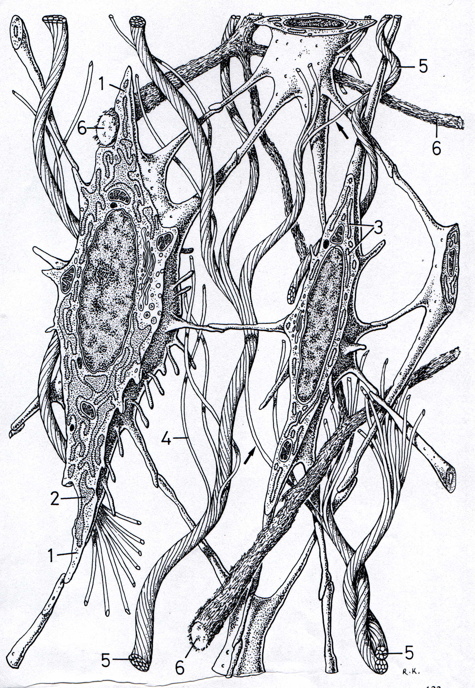

# FRA3715_H2020 : *Écriture et nouveaux médias*

## Séance 1 - *Introduction* : 8 Janvier

1. Présentation des enjeux du cours
- [podcast](https://mmellet.github.io/fra3715_h2020/podcast/seance1/Seance1-1.mp4)
- [slides](https://mmellet.github.io/fra3715_h2020/Seance1_1.html#/)

2. Présentation du calendrier et des modes de séances
- [podcast]()
- [slides](https://mmellet.github.io/fra3715_h2020/Seance1_2.html#/)

3. Présentation des modes d'évaluation
- [podcast]()
- [slides]()

4. Ressources documentaires 
- [slides]()

## Séance 2 - *Problématiser l'écriture et les nouveaux médias 1* : 15 janvier

- séances asynchrones : podcasts théorie
- séance synchrone : rencontre, question & discussion

## Séance 3 - *Problématiser l'écriture et les nouveaux médias 2* : 22 janvier

- séances asynchrones : podcasts théorie
- séance synchrone : rencontre, question & discussion

## Séance 4 - *Écriture Hypertexte* : 29 janvier 

- séances asynchrones : podcasts théorie & pratique
- séance synchrone : atelier, question & discussion

## Séance 5 - *Écriture multimédiale* : 5 février

- séances asynchrones : podcasts théorie & pratique
- séance synchrone : atelier, question & discussion

## Séance 6 - *Écriture codée* : 12 février 

- séances asynchrones : podcasts théorie & pratique
- séance synchrone : atelier, question & discussion

## Séance 7 - *Écriture collaborative* : 19 février 

- séances asynchrones : podcasts théorie & pratique
- séance synchrone : atelier, question & discussion

## Séance 8 - *Auto-édition* : 26 février 

- séances asynchrones : podcasts théorie & pratique
- séance synchrone : atelier, question & discussion

## Séance 9 - *Jeu d'identité* : 12 mars 

- séances asynchrones : podcasts théorie & pratique
- séance synchrone : atelier, question & discussion

## Séance 10 - *Écriture en réseaux* : 19 mars 

- séances asynchrones : podcasts théorie & pratique
- séance synchrone : atelier, question & discussion

## Séance 11 - *Écriture habitat* : 26 mars 

- séances asynchrones : podcasts théorie & pratique
- séance synchrone : atelier, question & discussion

## Séance 12 - *Écriture glitch* : 2 avril 

- séances asynchrones : podcasts théorie & pratique
- séance synchrone : atelier, question & discussion

## Séance 13 - *Écriture palimpseste* : 9 avril 

- séances asynchrones : podcasts théorie & pratique
- séance synchrone : atelier, question & discussion

## Séance 14 - *Titre à venir* : 16 avril

- séances asynchrones : podcasts théorie & pratique
- séance synchrone : atelier, question & discussion

