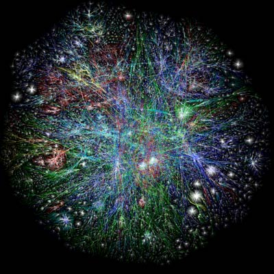
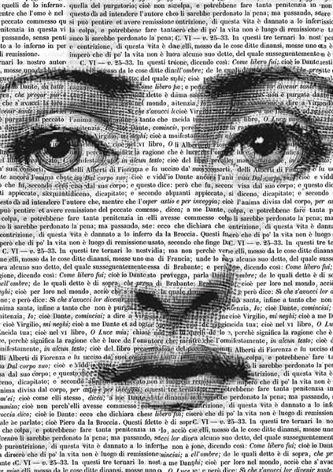
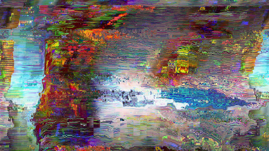

# FRA3715_H2020 : *Écriture et nouveaux médias*

## Séance 1 - *Introduction* : 15 Janvier

### Matériel asynchrone : 

[1.] Présentation des enjeux du cours

<ul>
  <li><a href="https://mmellet.github.io/fra3715_h2020/podcast/Seance-1/Seance-1-1.mp4" onclick = "window.open(this.href); return false;">podcast</a></li>
  <li><a href="https://mmellet.github.io/fra3715_h2020/slides/Seance-1-1.html#/" onclick = "window.open(this.href); return false;">slides</a></li>
</ul>  

[2.] Présentation du calendrier et des modes de séances
<ul>
  <li><a href="https://mmellet.github.io/fra3715_h2020/podcast/Seance-1/Seance-1-2.mp4" onclick = "window.open(this.href); return false;">podcast</a></li>
  <li><a href="https://mmellet.github.io/fra3715_h2020/slides/Seance-1-2.html#/" onclick = "window.open(this.href); return false;">slides</a></li>
</ul>

[3.] Présentation des modes d'évaluation
<ul>
  <li><a href="https://mmellet.github.io/fra3715_h2020/podcast/Seance-1/Seance-1-3.mp4" onclick = "window.open(this.href); return false;">podcast</a></li>
  <li><a href="https://mmellet.github.io/fra3715_h2020/slides/Seance-1-3.html#/" onclick = "window.open(this.href); return false;">slides</a></li>
</ul>

[4.] Ressources documentaires 
<ul>
  <li><a href="https://mmellet.github.io/fra3715_h2020/podcast/Seance-1/Seance-1-4.mp4" onclick = "window.open(this.href); return false;">podcast</a></li>
  <li><a href="https://mmellet.github.io/fra3715_h2020/slides/Seance-1-4.html#/" onclick = "window.open(this.href); return false;">slides</a></li>
</ul>

### Rencontre synchrone 

- horaire : 9h30 

- [lien pour la rencontre](https://jitsi.iro.umontreal.ca/FRA3715_H21-15janvier)

## Séance 2 - *Problématiser l'écriture et les nouveaux médias 1* : 22 janvier

### Matériel asynchrone : 

[1.] Structure de la séance

<ul>
  <li><a href="http://owncloud.ecrituresnumeriques.ca/index.php/s/wXOu2TLTTuQiqrp" onclick = "window.open(this.href); return false;">podcast</a></li>
  <li><a href="https://mmellet.github.io/fra3715_h2020/slides/Seance-2-1.html#/" onclick = "window.open(this.href); return false;">slides</a></li>
</ul>  

[2.] Volet I : Entre image et parole
<ul>
  <li><a href="http://owncloud.ecrituresnumeriques.ca/index.php/s/HukRvaQTAU2mXmr" onclick = "window.open(this.href); return false;">podcast</a></li>
  <li><a href="https://mmellet.github.io/fra3715_h2020/slides/Seance-2-2.html#/" onclick = "window.open(this.href); return false;">slides</a></li>
</ul>

[3.] Volet II : Pouvoir de l'écriture
<ul>
  <li><a href="http://owncloud.ecrituresnumeriques.ca/index.php/s/e4NLPgjNWGBPvn2" onclick = "window.open(this.href); return false;">podcast</a></li>
  <li><a href="https://mmellet.github.io/fra3715_h2020/slides/Seance-2-3.html#/" onclick = "window.open(this.href); return false;">slides</a></li>
</ul>

[4.] Volet III : L'écriture en tant que média
<ul>
  <li><a href="http://owncloud.ecrituresnumeriques.ca/index.php/s/kt1kqhQxmmtu70r" onclick = "window.open(this.href); return false;">podcast</a></li>
  <li><a href="https://mmellet.github.io/fra3715_h2020/slides/Seance-2-4.html#/" onclick = "window.open(this.href); return false;">slides</a></li>
</ul>

### Rencontre synchrone 

- horaire : 10h 

- [lien pour la rencontre](https://meet.jit.si/FRA3715_H21-22janvier)

Lecture pour la rencontre : <a href="http://owncloud.ecrituresnumeriques.ca/index.php/s/laUgZQJHTXAoPqs">Goody, L'Oralité et l'écriture</a>

## Séance 3 - *Problématiser l'écriture et les nouveaux médias 2* : 29 janvier

### Matériel asynchrone :

[1.] Structure de la séance

<ul>
  <li><a href="http://owncloud.ecrituresnumeriques.ca/index.php/s/c2xzZzOmbVNVR3e" onclick = "window.open(this.href); return false;">podcast</a></li>
  <li><a href="https://mmellet.github.io/fra3715_h2020/slides/Seance-3-1.html#/" onclick = "window.open(this.href); return false;">slides</a></li>
</ul>  

[2.] Volet I : Représenter le monde par des nombres
<ul>
  <li><a href="http://owncloud.ecrituresnumeriques.ca/index.php/s/QfqSMLpCKXcgMRB" onclick = "window.open(this.href); return false;">podcast</a></li>
  <li><a href="https://mmellet.github.io/fra3715_h2020/slides/Seance-3-2.html#/" onclick = "window.open(this.href); return false;">slides</a></li>
</ul>

[3.] Volet II : Numérique dans l'histoire des médias d'écriture
<ul>
  <li><a href="http://owncloud.ecrituresnumeriques.ca/index.php/s/9OE8MkZG0LwFTrz" onclick = "window.open(this.href); return false;">podcast</a></li>
  <li><a href="https://mmellet.github.io/fra3715_h2020/slides/Seance-3-3.html#/" onclick = "window.open(this.href); return false;">slides</a></li>
</ul>

[4.] Volet III : Matières à écrire numérique
<ul>
  <li><a href="http://owncloud.ecrituresnumeriques.ca/index.php/s/979ccDb4eu58QoW" onclick = "window.open(this.href); return false;">podcast</a></li>
  <li><a href="https://mmellet.github.io/fra3715_h2020/slides/Seance-3-4.html#/" onclick = "window.open(this.href); return false;">slides</a></li>
</ul>

### Rencontre synchrone 

- horaire : 10h

- [lien pour la rencontre](https://meet.jit.si/FRA3715_H21-29janvier)

Lecture pour la rencontre : <a href="http://owncloud.ecrituresnumeriques.ca/index.php/s/mBLYLRYXHFC9EHz">Monjour, Vitali-Rosati, Wormser : Le fait littéraire au temps du numérique (extrait)</a>
(l'article au complet est disponible dans le <a href="https://www.zotero.org/groups/2530325/fra3715-20/library">Zotero</a> ou <a href="http://owncloud.ecrituresnumeriques.ca/index.php/s/H0aqP8DtCRESpRo">ici</a>) 

Quizz : <a href="https://framaforms.org/quel-modele-de-representation-1611591085">Quel modèle de représentation ?</a>

## Séance 4 - *Écriture Hypertexte* : 5 février 

### Matériel asynchrone :

[1.] Structure de la séance

<ul>
  <li><a href="http://owncloud.ecrituresnumeriques.ca/index.php/s/ciDrgUssseALYOF" onclick = "window.open(this.href); return false;">podcast</a></li>
  <li><a href="https://mmellet.github.io/fra3715_h2020/slides/Seance-4-1.html#/" onclick = "window.open(this.href); return false;">slides</a></li>
</ul>  

[2.] Volet I : Poétique hypertextuelle
<ul>
  <li><a href="http://owncloud.ecrituresnumeriques.ca/index.php/s/MNQrBevuxNnxjBC" onclick = "window.open(this.href); return false;">podcast</a></li>
  <li><a href="https://mmellet.github.io/fra3715_h2020/slides/Seance-4-2.html#/" onclick = "window.open(this.href); return false;">slides</a></li>
</ul>

[3.] Volet II : Écriture hypertexte
<ul>
  <li><a href="http://owncloud.ecrituresnumeriques.ca/index.php/s/ZrwH7ISTeLEb033" onclick = "window.open(this.href); return false;">podcast</a></li>
  <li><a href="https://mmellet.github.io/fra3715_h2020/slides/Seance-4-3.html#/" onclick = "window.open(this.href); return false;">slides</a></li>
</ul>

[4.] Documentation
<ul>
  <li><a href="http://owncloud.ecrituresnumeriques.ca/index.php/s/0OcjlEAI8V56RQ0" onclick = "window.open(this.href); return false;">podcast</a></li>
  <li><a href="https://demo.hedgedoc.org/yeFepgMtRbqCB72ZyEKM6A?both#" onclick = "window.open(this.href); return false;">document partagé</a></li>
</ul>

### Rencontre synchrone 

- horaire : 10h

- [lien pour la rencontre](https://meet.jit.si/FRA3715_H21-5fevrier)

- [Se créer un compte Hypothes.is](https://web.hypothes.is/start/)

## Séance 5 - *Écriture multimédiale* : 12 février

- séances asynchrones : podcasts théorie & pratique
- séance synchrone : atelier, question & discussion

## Séance 6 - *Écriture codée* : 19 février 

- séances asynchrones : podcasts théorie & pratique
- séance synchrone : atelier, question & discussion

## Séance 7 - *Écriture collaborative* : 26 février 

- séances asynchrones : podcasts théorie & pratique
- séance synchrone : atelier, question & discussion

## Séance 8 - *Auto-édition* : 12 mars 

- séances asynchrones : podcasts théorie & pratique
- séance synchrone : atelier, question & discussion

## Séance 9 - *Écriture en réseaux* : 19 mars 

- séances asynchrones : podcasts théorie & pratique
- séance synchrone : atelier, question & discussion

## Séance 10 - *Écriture habitat* : 26 mars 

- séances asynchrones : podcasts théorie & pratique
- séance synchrone : atelier, question & discussion

## Séance 11 - *Écriture glitch* : 2 avril 

- séances asynchrones : podcasts théorie & pratique
- séance synchrone : atelier, question & discussion

## Séance 12 - *Écriture palimpseste* : 9 avril 

- séances asynchrones : podcasts théorie & pratique
- séance synchrone : atelier, question & discussion

## Séance 13 - *Titre à venir* : 16 avril

- séances asynchrones : podcasts théorie & pratique
- séance synchrone : atelier, question & discussion

